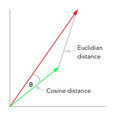
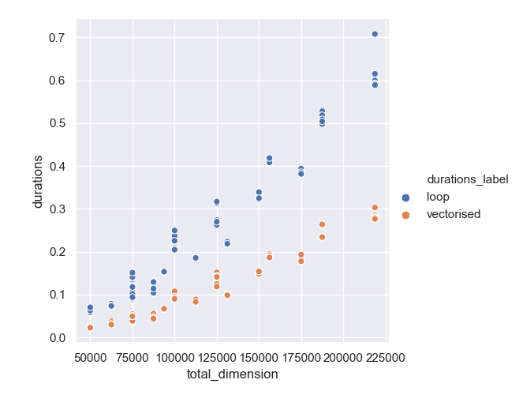

# Benchmarking cosine similarity implementations

As part of creating an encoder/decoder model, we want to find the `cosine` distance between each row in one array and each row in a second using `scipy.spatial.distance.cdist`. One implementation will loop through the first array row by row, find the cosine distance and keep track of the lowest value. The second will take a vectorised approach to find the cosine similarity between the two matrices and then find the smallest cosine distance for each row.

## Motivation

A tutorial I was following used a loop implementation of the `cdist` search, I vectorised it in my own code, but I wanted to know what the benefit was in real terms. The exercise of semi-formally benchmarking the implementations was also useful.

## pre-requisites

- Python 3.6.3 / pip 18.0 (I use Pyenv and virutalenv)

### Preparing the environment

The `setup.sh` script may be helpful in setting up your environment, assuming you have already installed `pyenv` and `virtualenv` (see my tutorial [Python dependency - hell no!](http://www.webpusher.ie/2018/09/19/python-dependency-hell-no/))

As you need to use Seaborn, which requires `matplotlib` you will need to have installed Python 3.6.3 as a framework, using Pyenv. This is relatively easy, [see my tutorial on installing](https://www.webpusher.ie/2018/07/07/pyenv-matplotlib-high-sierra/)

The script contains the following

```bash
pyenv virtualenv 3.6.3 cdisttimings
pyenv local cdisttimings

pip install -U pip

pip install -r requirements.txt
```

Once you run that you should be ready to go.

## Why cosine distance? Why not euclidian distance?

The use-case here is finding similarities between the word embeddings in two matrices - for word embeddings the amplitude of the vector does not matter as they should have been normalised, the angle between vectors is important.

The Euclidian distance finds the geometrical distance between the vectors, while the cosine distance (or similarity) finds the angle between the vectors.



## Running the benchmark

You can run the script using the command

```bash
python cdisttimings.py
```

This will produce output resembling

```bash
Starting benchmarks for matrix shape (1250, 150) running 3 loops with 5 repeat timings for each implementation

Timing run 1
running loop implementation
average loop duration = 0.5097540697548538
running vectorised implementation
average vectorised duration = 0.23319520922377707

Timing run 2
running loop implementation
average loop duration = 0.5055707193911075
running vectorised implementation
average vectorised duration = 0.23917289525270463

Timing run 3
running loop implementation
average loop duration = 0.5063449165783822
running vectorised implementation
average vectorised duration = 0.2333633008878678
vectorised is 2.1561598281696814 times faster
```

The script will create a scatter plot of the timing data for running the loop implementation compared to the vectorised implementation.

## Notes on the implementation

We are comparing how long it takes two implementations to find the most similar vectors between two matrices.

To generate the data, we loop through a range of axis sizes for the two matrices, then we run a timing test against the implementations a number of times, generating unique matrices each time - matching the current axis dimensions. We also repeat the timing test for each set of data a number of times to even out any variations.

Each row of data contains the `x` and `y` axis dimensions of the two matrices/arrays and the full set of repeated results for each data set.

```
| x-dimension | y-dimension | loop duration       | vectorised duration |
| ----------- | ----------- | ------------------- | ------------------- |
| 1000        | 300         | 0.05951278214342892 | 0.02336036693304777 |
```

To plot the data we calculate the total dimension by multiplying the `x` and `y` dimension, using that as the x-axis to the plot. The values of the duration are plotted on the y-axis.


### Results

The gain is _only_ a factor of 2, but the implementation is also much simpler.

You scatter plot should look something like


